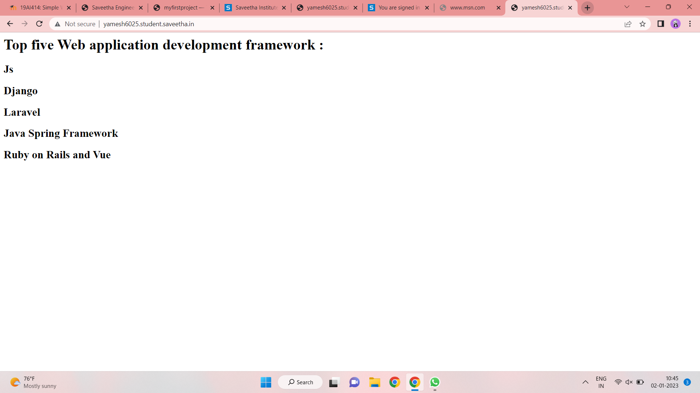

# Developing a Simple Webserver

# AIM:
NAME :YAMESH R
Ref No :22008991

# DESIGN STEPS:

## Step 1:

HTML content creation is done

## Step 2:

Design of webserver workflow

## Step 3:

Implementation using Python code

## Step 4:

Serving the HTML pages.

## Step 5:

Testing the webserver

# PROGRAM:
```
Conversation opened. 1 read message. 

Skip to content
Using Gmail with screen readers
Enable desktop notifications for Gmail.
   OK  No, thanks
10 of 55
(no subject)
Inbox

Chethan Kumar <chethankumarg26@gmail.com>
Fri, 23 Dec 2022, 21:41
to me

from http.server import HTTPServer, BaseHTTPRequestHandler

content = """
<html>
</head>
</head>
<body>
<h1>WELCOME</h1>
<h2>NAME:R YAMESH</h2>
<h2>REF.NO.:22008991</h2>
<h3>LIST OF FRAMEWORKS</h3>
<h4>-Django</h4>
<h4>-Ruby on Rails</h4>
<h4>-Angular</h4>
</body>
</html>
"""

class Hellohandler(BaseHTTPRequestHandler):
    def do_GET(self):
        self.send_response(200)
        self.send_header('Content-type','text/html; charset=utf-8')
        self.end_headers()
        self.wfile.write(content.encode())
server_address = ('',80)
httpd = HTTPServer(server_address, Hellohandler)
httpd.serve_forever()
```


# OUTPUT:


# RESULT:

The program is executed succesfully
